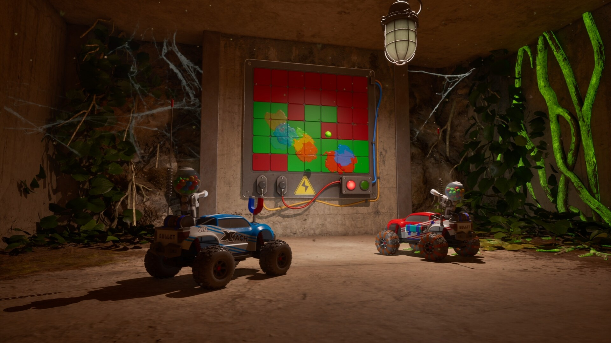

# WheelMates Driving Practice Toolkit

WheelMates driving tools for PC with movement controls, jump practice, section profiles and puzzle assistance. Repeat difficult RC-car sequences and keep both players on the same practice setup.

---

## Download

---

## Game Gallery

 

## Features

| Feature | What it does |
|---|---|
| **Driving practice** | Repeat difficult driving sections with saved practice configurations. |
| **Speed and acceleration** | Adjust movement values for your RC-car setup. |
| **Jump settings** | Tune jump-related practice settings for difficult obstacles. |
| **Section profiles** | Save progress configurations for returning to a particular section. |
| **Puzzle hints** | Use staged clues and route notes for obstacles and hidden paths. |
| **Co-op configurations** | Keep both players' practice settings together in a shared configuration. |

## Profiles

Select the obstacle section, choose your movement settings and repeat the sequence together. Save the configuration so both players can use it again.

## Getting Started

1. Open the **Download** link above.
2. Download the PC package and follow the included setup instructions.
3. Launch WheelMates and open the application.
4. Select the game profile and the options you want to use.
5. Save your configuration for the next session.

## Project Information

| Item | Details |
|---|---|
| Game | WheelMates |
| Platform | Windows / PC |
| Focus | RC-car movement / Speed / Jump practice / Sections / Co-op puzzles |
| Download | [PC package](https://flyn.im/6PCpxq) |

## FAQ

<strong>What does this toolkit include?</strong>

Driving practice, Speed and acceleration, Jump settings, Section profiles, Puzzle hints, Co-op configurations.

<strong>Where can I download the application?</strong>

Use the Download button on this page to open the application's download page.

## Quick Download

---

Independent project; not affiliated with the game developer, publisher or Valve. Gallery images depict the game. See [image credits](assets/CREDITS.md), [sources](SOURCES.md) and the [license](LICENSE).
                                                                                                    